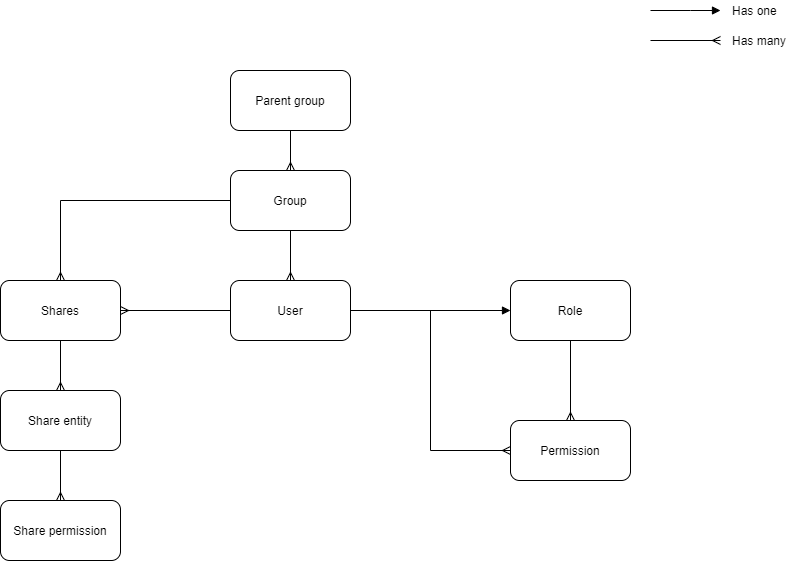

# Introduction to Administration

## Concepts
On Rapide, the user administration is made using a role-based permission model. It is important to understand the following concepts in order to manage users easily and securely. 

### Groups
A Group is a list of Users. They are used in order to allow users to share work.

Only users belonging to the same group can "see each other".

A user can only belong to one group.

Belonging to a Group does not grant any kind of Permission.

### Parent groups
It is possible for a group to be nested under a parent group.

When this is in place : 

- Members of the parent group can "see" members of children groups
- Members of the children group cannot "see" members of the parent group

This allows to create "management" groups that can administrate multiple teams at once.

### Group manager
A User can be assigned to permission to be the "Group Manager". When granted this permission, the User can invite other Users to join the Group, or remove them from the group.

### Shares
Sharing allows you to delegate access to your Surveys.
You can share a survey with a recipient : single User or a Group, and control 2 Share Permissions : 
 - Level of access of the share : View, Edit or Delete 
 - Ability for the recipient to re-share your work or not.

When choosing a recipient for the share, you can only choose among User that you can "see" (Users in your Group or in children Groups)

### Permissions
Permissions define what a User can do on the platform.
 - Which modules are available
 - Which actions can be done on each module
 - Wether ir not the user has access to the Administration
 - When having access to the Administration, what entities can be accessed (Users, Groups, Roles)

### Roles
Roles are a collection of Permissions, allowing to manage many Users at once. Users can only be granted 1 Role.

### Surveys
Surveys are created by Users, and then kept private, or shared with other Users or Groups. The list of surveys seen in the Surveys tab is the collection of Surveys owned by your User, or shared with your User or Group.

