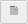

# Portfolio links

You can publish Portfolio(s) to a URL, and share its link with co-workers or clients, thereby giving them access to your Portfolio's tables and charts.

To publish a Portfolios, click the  `View` menu, then `Portfolio links`.

The `Portfolio links` view covers several areas of the screen:

- the table results
- the properties,
- Rows, Columns and Edges panels

To close the view (and reveal these areas of the screen again), click `Close` located at the top right-hand corner of the screen. Alternatively, at the top of the screen, click `View`, then `Cross-Tab def`.

## Create

1.  In the `Portfolio links` view, click `New portfolio link`:
    
2.  [Define](#define) the Portfolio link
3. Click `Save`

## Duplicate

If you want to create a Portfolio link based on an existing one, you can:

1.  In the `Portfolio links` view, select the Portfolio link you want to copy from the drop-down list.
2.  Click `Duplicate the portfolio link`:
    
3.  [Define](#define) the Portfolio link
4. Click `Save`

## Edit

1.  In the `Portfolio links` view, select the portfolio link you want to edit from the drop-down list.
2.  [Define](#define) the Portfolio link
3. Click `Save`

## Define

The following fields define a Portfolio link:

### Link parameter

This is the ending of the URL for the link. If you leave this blank, askiavista will automatically generate the parameter. You can enter your own string of characters to define your own custom URL (e.g. *surveyreport2014*).

### Name

Specify a name for the portfolio link. The name will appear in the header of the generated portfolio link.

### Description

This optional field allows you to enter a description for the portfolio link to help you identify the link in future.

### Portfolio

In the drop-down list, select the portfolio you want to link to.

### Default display

In this drop-down list, select the Portfolio's Table or Chart or Section page, which you want to display by default.

!!! note
    Recipients of the link will be able to switch to other tables and charts in the Portfolio.
    
    This setting merely specifies what will be displayed when first loading the Portfolio link.

### Expires at

If you want the Portfolio link to be unavailable after a certain date, specify that date here.

!!! note 
    When you specify an [Expiry date](#expires-at), anyone who tries to access the Portfolio after this date will see an error message telling them _"the link has expired"_.
    
    However, you can customize this expiry message & screen.
    
    For details, see: [Set up a custom Expired Portfolio link page for Portfolios](https://support.askia.com/hc/en-us/articles/201995441).

### Layout

Select `sidebar` if you want the portfolio tables/charts to be presented in a sidebar at the left-hand edge of the screen. Select `horizontal menu` if you want them to be presented in a drop-down menu at the top of the screen.

### Theme

Themes allow you to customize the look & feel of Portfolio link pages.

If Themes are already defined for your AskiaVista account, you can select them here.

Using custom Themes for your Portfolio links, allows you to tweak their appearance, and ensure their look is consistent between your portfolios.

You can also use different Themes, for different end clients.

!!! Note
    Creating a Theme requires knowledge of `HTML` and `CSS`.

You can also click `Manage` to create, edit, share and delete Themes.

#### Create

To create a new Portfolio link Theme, you need to have a suitable CSS file ready that defines the theme.

The easiest way to do this is to download the CSS file of an existing Theme, edit it, and then upload it in a new Theme.

For example, we will create a new Theme, using the `Default` Theme provided with AskiaVista.

1. Click `Manage`.
2. In the `Theme manager`, select the `Default` Theme.
3. Click `Download`.
4. Unzip the file.
5. Locate the file `theme.css` and edit it.
6. In the `Theme manager`, click `Create a new theme`:
    
7. Give a `Name` to the theme.
8. Click `Select file`, and select `theme.css` you just customized.
9. Click `Save`.
10. Click `Close`.

#### Edit

1. Click `Manage`.
2. In the `Theme manager`, select the Theme you wish to edit.
3. Click `Download`.
4. Unzip the file.
5. Locate the file `theme.css` and edit it.
6. Go back to `Theme manager`.
7. Click `Select file`, and select `theme.css` you just customized.
8. Click `Save`.
9. Click `Close`.

#### Share

You can share a Theme with other AskiaVista users.

1. Click `Manage`.
2. In the `Theme manager`, select the Theme you want to share.
3. Click `Share the current theme`:
    
4. The `Share Theme` window appears, displaying a list of users with whom the Theme is currently shared.
5. To add a user to the list:
   1. Click in the text-box at the bottom of the window.
   2. Start typing a user's name, and select their account
   4. Once the user(s) are specified, click `Add`.
6. Finally, click `Share`.

!!! Tip
    You can revoke access to a shared Theme by deleting the relevant user account(s) in the `Share Theme` window, ie. click on .

You can specify both Access & Sharing rights for each user in the list; ie. select the appropriate option for each user account:

- **View only**: User will be able to use the Theme.
- **Can edit**: User will be able to use the Theme, and make changes to it.
- **Is owner**: User will be granted owner privileges to the Theme; they will be able to use the Theme, make changes to it, and delete it.
- **Cannot Share**: User will not be able to share the Theme with other users.
- **Can Share**: User will be able to share the Theme with other users.

#### Delete

You can delete a Theme, if you have the appropriate rights for that Theme.

1. Click `Manage`.
2. In the `Theme manager`, select the Theme you want to share.
3. Select the Theme you wish to delete.
4. Click `Remove the current theme`: 

### Left logo

In the drop-down list, select the logo that you want to appear at the top left of your portfolio link screen, or select `None` to have no logo in that position. You can upload image files to your account, to use as logos: see [managing resources](managing_resources.md) for details. The logo can be set up to link to a specific URL when clicked. In `Title`, enter the text you want to appear in the tooltip that appears when the mouse pointer is held over the logo. In `Target URL`, enter the URL that you want the logo to link to when clicked, or leave it blank if you do not want the logo to act as a clickable link.

### Right logo

In the drop-down list, select the logo that you want to appear at the top right of your portfolio link screen, or select `None` to have no logo in that position. You can upload image files to your account, to use as logos: see [managing resources](managing_resources.md) for details.  The logo can be set up to link to a specific URL when clicked. In `Title`, enter the text you want to appear in the tool-tip that appears when the mouse pointer is held over the logo. In `Target URL`, enter the URL that you want the logo to link to when clicked, or leave it blank if you do not want the logo to act as a clickable link.

### Footer

Enter the text that you want to appear at the bottom of the portfolio link screen, or leave this field blank to have no text appear there.

### Filters

#### Additional

If you select a filter from the drop-down list, it is applied to all tables and charts in the portfolio. It cannot be switched off by the person viewing the portfolio link.

#### Allow Access

This option determines whether other filters will be available to recipients of the link. If so, they will be able to apply or remove these filters as desired. Note that any filters they apply will be in addition to any filter you select in `Additional filter` (see above). Select here as follows:

- `Cannot access`: the recipient will not be able to apply any filters.
- `Access all filters`: the recipient will be able to apply any of the filters available in the survey.
- `Only access selected filters`: If you select this option, `Available filters` box appears, which allows you to specify the filters that will be available to link recipients. Click in this box to select a filter from the drop-down list, and thereby add it to the list of filters available to the respondent. Click the **x** icon to remove a filter from the box.
    - `Available filters`: Specify the filters available to the respondent.
    - `Allow multiple selection`: If selected, link recipients will be able to apply more than one filter at the same time to the tables and charts in the Portfolio.

### Questions

#### Allow Access

This option allows you to grant access to questions from a profile or profiles; link recipients can then use these questions in the rows, columns or edges of the tables/charts in the portfolio. When they select a question, any question in the rows, columns or edges will be subsituted with the one they selected.

##### Cannot access

Link recipients will not be able to select questions to appear in the rows, columns or edges of the tables/charts they view.

##### Rows

Link recipients will be able to select question(s) in Rows.

##### Columns

Link recipients will be able to select question(s) in Columns.

##### Edges

Link recipients will be able to select question(s) in Edges.

- `Target`: Specifies which questions will be available for link recipients to display in their tables/charts. Select as follows:
- `Profiles`: allows link recipients to select questions from a Profile.
    - `Available Profiles`: specify the Profile(s) from which link recipients will be able to select questions.
- `Questions from a profile`: allows link recipients to select questions for display from a Profile.
    - `Available Questions`: specify the question(s) which link recipients will be able to select.

## Save

When you have finished creating or editing the portfolio link, you will want to save your changes. At the top of the variables view, click `Save the portfolio link`:

## Delete

2.  In the portfolio links view, select the portfolio link you want to delete from the drop-down list.
3.  Click `Delete portfolio link`:
    .png)
4.  When you are asked to confirm your choice, click `Yes`.

## Test and Share

You can test a Portfolio link to preview its appearance before sharing it.

To test a Portfolio link, first ensure it is saved, so that you will be testing the current version, then click `Test link`:

The Portfolio link opens in a new browser tab.

- If you find that you want to make further changes to the link, simply close the browser tab and continue editing in askiavista.
- If, however, you are satisfied with the link and want to share it, select the link URL by clicking in your browser's address bar**.** Press ++ctrl+c++ to copy the link, and share it!
