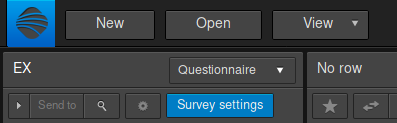
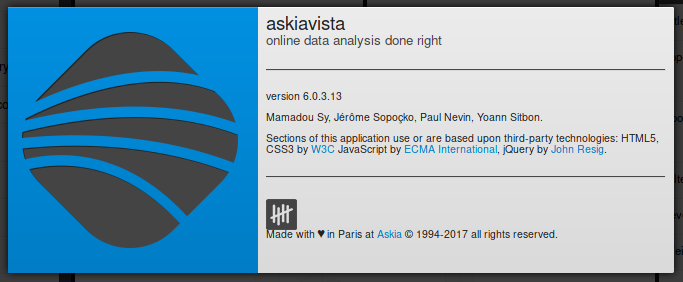

# What's new in AskiaVista?
 

Our _Version History_ and latest changes are available [here](https://dev.askia.com/projects/askiaanalysis/wiki/Vista_Version_history).

??? tip "How do I know which version I'm using?"
    - Browse to your AskiaVista URL
    - Click on the logo at the top left-hand corner of the screen:
    
    

    - A small window should display:

    

!!! note
    Visit our [Help Centre](https://support.askia.com/hc/en-us) to keep up to date with the latest info on any [Askia](https://www.askia.com) product.
